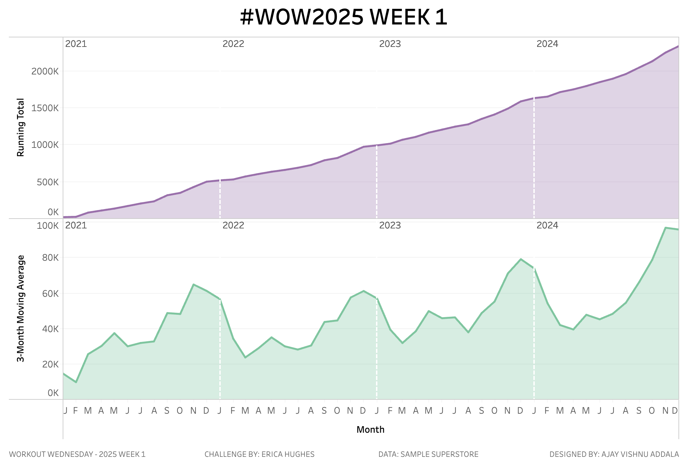

# Workout Wednesday 2025 | Week 1 | Replicating Quick Table Calcs in Tableau  

## Introduction  
This repository contains my solution for the Workout Wednesday 2025 Week 1 Challenge. The goal was to create two area charts without using Quick Table Calculations or the `RUNNING_SUM()` function, using Tableau and the Sample Superstore dataset (2024 version).  

The challenge involves:  
1. A Running Total of Sales by Month  
2. A 3-Month Moving Average of Sales by Month (including the 2 previous months + the current month)  

## Challenge Details  
- **Dashboard Size**: 1000 x 700  
- **Dataset**: Sample Superstore (2024 version)  
- **Restrictions**:  
  - No Quick Table Calcs  
  - No `RUNNING_SUM()` function  
- **Requirements**:  
  - Two area charts with colors `#a16eaf` (Running Total) & `#67c79c` (Moving Average)  
  - Matching tooltips and formatting  
  - Single worksheet solution  

## Solution Overview  
This solution utilizes custom calculated fields to replicate Quick Table Calculations:  
1. **Running Total**:  
   A calculated field was created to compute the cumulative sum of sales by month.  
2. **3-Month Moving Average**:  
   A calculated field was created to compute the average of sales over the current and prior two months.  

The solution is designed in Tableau, meeting all requirements of the challenge.  

## Repository Contents  
- **Dataset**: The Sample Superstore data used for this challenge.  
- **Tableau File**: The `.twbx` file with the solution.  
- **Snapshot**: A screenshot of the final dashboard.  
- **Video Demo**: A demo video showcasing the solution (`Video Demo.mov`).  

## Snapshot of the Solution  
  

## Tableau Public Dashboard  
Check out the published dashboard on Tableau Public: [Link to Tableau Dashboard](https://public.tableau.com/views/WOW2025W1_17359208017580/WOW2025W1?:language=en-US&:sid=&:redirect=auth&:display_count=n&:origin=viz_share_link)  

## Challenge Inspiration  
This challenge was created by Erica Hughes for Workout Wednesday 2025. Original challenge details can be found [here](https://www.workout-wednesday.com).  

## Share Your Feedback  
Feel free to reach out or connect with me for feedback or suggestions. Happy vizzing! 🎨  
